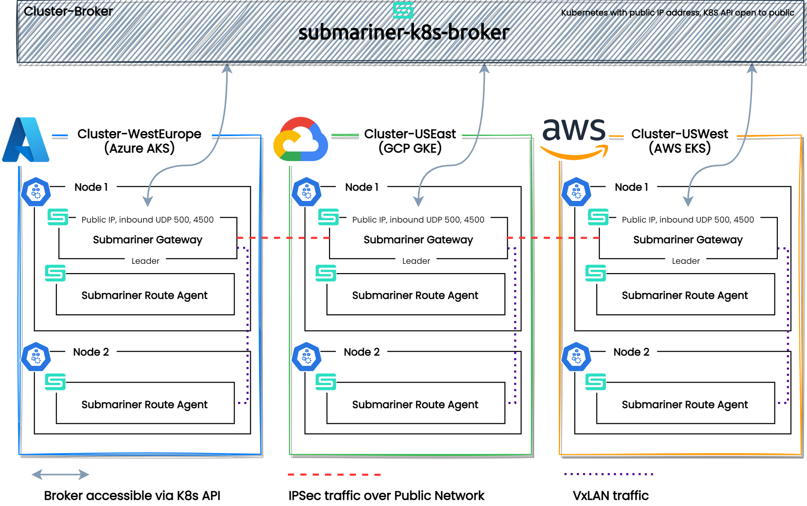

# Kubernetes multi-cluster connectivity using Submariner

## Background

The current trend within Kubernetes-based platforms shows that companies are no longer focusing on building large multi-tenant cluster. Instead, it is becoming common to build individual clusters specific to a region/cloud. In this scenario, inter-cluster connectivity plays a crucial role. 

This architecture can be valuable in a vast number of use-cases. Some of the most prominent benefits include:

- **Increased scalability & availability, global distribution.** In a multi-cluster setup, an application can be distributed across different regions providing users with exceptional availability and a much better experience interacting with an app due to reduced latency.
- **Regulatory compliance.** Applications that involve dealing with user data must adhere to regulations like GDPR, CCPA, etc. Some of these regulations require user data to be stored within certain geographical limits and the multi-cluster setup can help achieve this.
- **Reduced vendor dependency.** Your application is no longer dependent on a single cloud provider and can easily move to an alternative vendor without substantial costs.
- **Vendor-specific features.** At the same time, your app can take advantage of a feature specific to a cloud provider without being fully locked-in.

The purpose of this project is to test the capabilities of Submariner and the multi-cluster multi-cloud architecture.

## Objectives
- [ ] Deploy a Kubernetes cluster in AKS (West Europe region)
- [ ] Deploy a Kubernetes cluster in GCP (US East region)
- [ ] Deploy a Kubernetes cluster in AWS (US West region)
- [ ] Establish a secure multi-cluster (and multi-cloud) L3 network connection between the clusters using Submariner
- [ ] Test the inter-cluster connectivity using CockroachDB features Geo-Distribution and Geo-Replication

## Architecture Overview

## Step-by-step

## References
- The project is inspired by the article [Kubernetes Multi-Cloud and Multi-Cluster Connectivity with Submariner](https://www.linkedin.com/pulse/kubernetes-multi-cloud-multi-cluster-connectivity-gokul-chandra) by Gokul C.
- [Kubernetes Multi-Clusters: How & Why To Use Them](https://www.bmc.com/blogs/kubernetes-multi-clusters/) by Shanika W.

